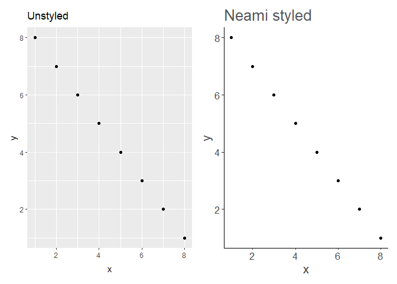
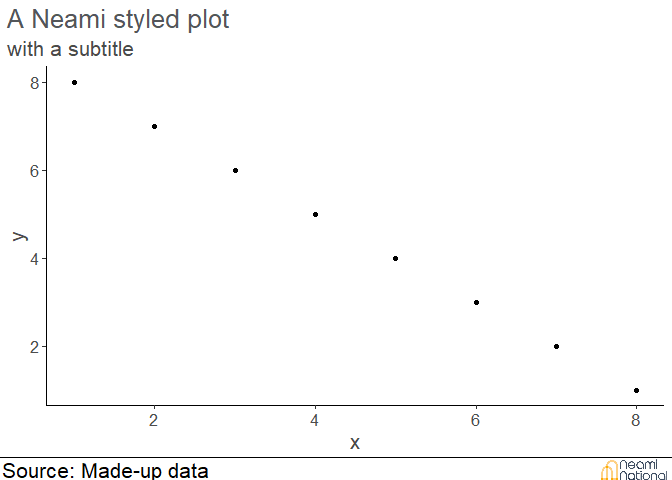

<!-- README.md is generated from README.Rmd. Please edit that file -->

# neami

<!-- badges: start -->
<!-- badges: end -->

The goal of neami is to support the production of high-quality research
and evaluation reports within the organisation. It borrows functionality
from the BBC bbplot\](<https://github.com/bbc/bbplot>) package and the
[ochRe](https://github.com/hollylkirk/ochRe) package.

## Installation

You can install the development version of neami like so:

``` r
remotes::install_github("Lingtax/neami")
```

## Example

This is a basic example which shows you how to solve a common problem:

``` r
library(neami)
library(tibble)
library(ggplot2)
library(patchwork)
## basic example code
df <-  tibble(x = 1:8, y = 8:1)
p1 <- ggplot(df, aes(x, y)) +
  geom_point()

(p1 +labs(title = "Unstyled")) + (p1 +labs(title = "Neami styled") + theme_neami())
```



For final publication, graphs can be finalised with a Neami logo and
source of data.

``` r
p1 <- p1 + labs(title = "A Neami styled plot", 
                subtitle = "with a subtitle") + theme_neami()
finalise_plot(p1, source = "Made-up data", save = FALSE)
```



## Managing fonts.

Neami standards are in the style guide To enable the fonts, install
Utopia Std and Brandon text, then run:

``` r
install.packages(extrafont)
library(extrafont)
font_import()
loadfonts(device = "win")
```
