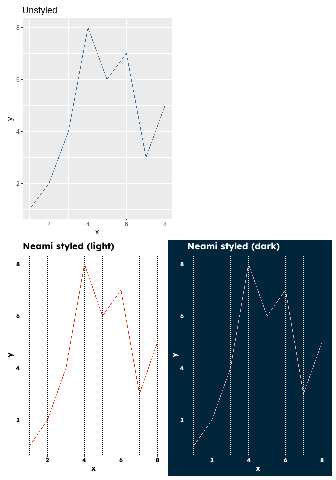
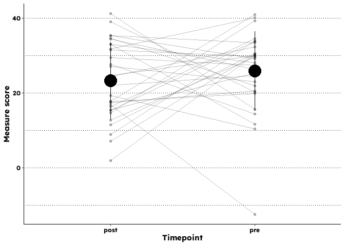

<!-- README.md is generated from README.Rmd. Please edit that file -->
<!-- badges: start -->
<!-- badges: end -->

The goal of the neami package is to support the production of
high-quality research and evaluation reports within the organisation.

## Installation

You can install the development version of neami like so:

``` r
remotes::install_github("Lingtax/neami")
```

## Examples

A core set of functions exist to support graphs in brand consistent
formats.

``` r
library(neami)
#> No human is illegal
library(tibble)
library(ggplot2)
library(patchwork)
## basic example code
df <-  tibble(x = 1:8, y = sample(8:1, 8),  colour = 1)
p1 <- ggplot(df, aes(x, y, colour = colour)) +
  geom_line()  +
  guides(colour = FALSE)
  

(((p1 + labs(title = "Unstyled"))  + plot_spacer()) / 
  ((p1 +labs(title = "Neami styled (light)") + theme_neami() + scale_colour_neami_c("core_qual")) +
  (p1 +labs(title = "Neami styled (dark)") + theme_neami_dark() + scale_colour_neami_c("core_qual_light")) 
     ))
```



Other functions exist to support common analysis and reporting tasks
including calculation and reporting of group level change and individual
reliable change metrics.

``` r
showtext::showtext_auto()
test <- data.frame(person = 1:30, pre = rnorm(30, 30, 9.2), post = rnorm(30, 22, 9.2))

add_k10_change(test, pre, post) %>% janitor::tabyl(rel_k10_change)
#> Warning: Using one column matrices in `filter()` was deprecated in dplyr 1.1.0.
#> ℹ Please use one dimensional logical vectors instead.
#> ℹ The deprecated feature was likely used in the dplyr package.
#>   Please report the issue at <https://github.com/tidyverse/dplyr/issues>.
#> This warning is displayed once every 8 hours.
#> Call `lifecycle::last_lifecycle_warnings()` to see where this warning was
#> generated.
#>  rel_k10_change  n   percent
#>       Decreased 12 0.4000000
#>       Increased  8 0.2666667
#>       Unchanged 10 0.3333333

# Caption a t-test 
caption_ttest(t.test(test$pre, test$post, var.equal = TRUE))
#> [1] "The difference between groups was not statistically significant (t(58) = 0.95, p = .345, d = 0.25)"

test %>% tidyr::pivot_longer(cols = pre:post) %>% 
paired_t_plot(x= name, y = value, group = person)
```


